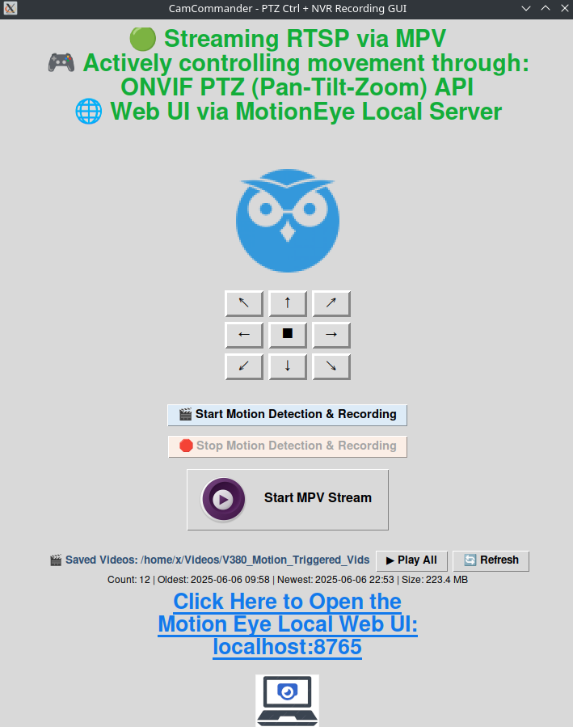

# NVR_PTZ_ONVIR_All_In_One_Cam_Commander

**NVR_PTZ_ONVIR_All_In_One_Cam_Commander** is a powerful all-in-one video suite for ONVIF-compatible IP cameras, delivering instant PTZ control, motion-triggered recording, and integrated MotionEye web server access—no NVR hardware required.

## 🚀 Features

- 🎮 **Full PTZ Control:** Move your camera in 9 directions using a streamlined Tkinter GUI, powered by ONVIF protocol button controls.
- 📺 **Live RTSP Streaming:** Instantly view your camera feed in the integrated MPV video player—stream starts in sync with your movement commands.
- 🎯 **Smart Motion Detection:** Enable or disable Motion.py motion-triggered recording with a single click; all events are automatically archived to your PC.
- 🌐 **MotionEye Integration:** Seamlessly launches the MotionEye web server in the background, with a convenient clickable shortcut right in the GUI ([http://localhost:8765](http://localhost:8765)).
- 🛠️ **Auto-Config Updates:** Dynamically edits a safe, local copy of `motion.conf` with your camera’s live RTSP URL, making configuration rapid and permission-friendly.
- 🔄 **Effortless Camera Switching:** Remembers and lists all your previous IPs, usernames, and passwords—switch cameras or accounts in seconds.
- 🧩 **Flexible Deployment:** Instantly transform any PC or Raspberry Pi into a powerful, networked IP camera recorder for your surveillance setup.
- 💻 **Command-Line Ready:** Launch with an IP argument for easy automation or scripting:  
```
  python3 NVR_PTZ_ONVIR_All_In_One_Cam_Commander_Tkinker_GUI.py 192.168.1.xx
  cp -v NVR_PTZ_ONVIR_All_In_One_Cam_Commander_Tkinker_GUI.py /opt/ccgui.py
```
🐍 Useful Real-Time Debug Info: Get detailed debug output at every launch—know exactly what the script is doing and never be left guessing about backend activity and events.

📦 Requirements
Python 3.8+

Tkinter (usually preinstalled)

onvif-zeep (pip install onvif-zeep)

mpv media player (Linux package: mpv)

Motion (Linux package: motion)

MotionEye (for web interface)

(Optional for notifications) ffmpeg if your motion.conf uses video/audio processing hooks

🏴 Debian/Ubuntu Quick Install
```
sudo apt update
sudo apt install python3 python3-pip python3-tk mpv motion ffmpeg git
pip3 install onvif-zeep
# For motionEye (optional web UI):
# See https://github.com/motioneye-project/motioneye for latest install method
```

🅰️ Arch Linux Quick Install
```
sudo pacman -S python-tkinter python-pip mpv motion ffmpeg git
pip install onvif-zeep
# For motionEye: see https://github.com/motioneye-project/motioneye
```
📖 Quick Start
Install dependencies (see above).

Edit your motion.conf as needed (use placeholders for RTSP URL if you wish).

(Optional) Copy or rename the script for easier launching:
```
cp -v NVR_PTZ_ONVIR_All_In_One_Cam_Commander_Tkinker_GUI.py /opt/ccgui.py
```
Create a Fish shell alias for quick access:
```
alias ccgui 'python3 /opt/ccgui.py'
funcsave ccgui
```
Launch the script:
```
python3 NVR_PTZ_ONVIR_All_In_One_Cam_Commander_Tkinker_GUI.py 192.168.1.xx
```
or with your alias:
```
ccgui 192.168.1.xx
```

Click the link or PC Icon at the bottom to open the MotionEye web UI.

Enjoy your new open-source IP-Camera command and control center! 😎

